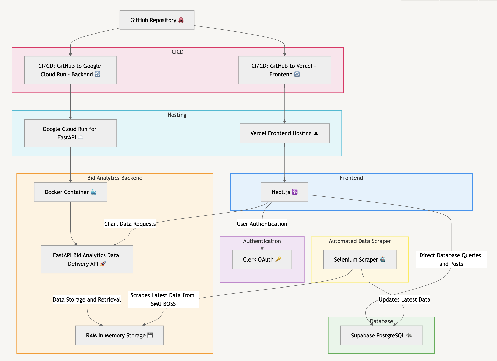

# SMU BidWise - IS216 G2T4 Group Project

### SMU BidWise

> Course planning platform for Singapore Management University Students<br>
> Production Site: [smubidwise.com](https://www.smubidwise.com)

### To Start Local Development Server (Next.js Frontend)
```
cd frontend-website
npm i # install packages
npm run dev # run local dev server
```

### Test user credentials
```
login using **google account** with clerk authentication
Gmail: bidwiseuser@gmail.com
Password: bidwiseUser24

# OR: use your personal google account

```

### To Install and run Selenium Scraper
```
cd scrapers
python -m venv env
source env/bin/activate 
# for windows machines: source env/Scripts/activate
pip install -r requirements.txt

cd scrapers/BOSS_scraper # scrapes course data from BOSS
mkdir scrapedData
python main.py <6-digit-authenticatorapp-code>

```
### Architecture Diagram:

| **Component**               | **Description**                                                                                   |
|-----------------------------|---------------------------------------------------------------------------------------------------|
| **Frontend**                | Next.js Application: Hosted on Vercel.                                                            |
| **Database**                | Supabase PostgreSQL                                                                               |
| **Bid Price Analytics API** | FastAPI: API with in-memory storage for low-latency reads                                         |
|                             | Dockerised: Containerised for scalable deployment on Google Cloud Run                             |
| **Authentication**          | Clerk OAuth: Secure user authentication and user management                                        |
| **Automated Data Scraper**  | Selenium Scripts: Keeps BidDataStore and Supabase PostgreSQL updated with real-time data from SMU BOSS |


### SMU BidWise Features:
| **Feature**                  | **Description**                                                                                   |
|------------------------------|---------------------------------------------------------------------------------------------------|
| **Simplified Course Lookup** | All course information in one place                                                               |
|                              | Easy search using the course search bar                                                           |
|                              | View comprehensive details on one page, including vacancies, areas, prerequisites/corequisites, and available sections |
|                              | Access student course ratings                                                                     |
| **Bid Analytics**            | View clear past bid prices and trends                                                             |
|                              | Make informed, data-driven bidding decisions                                                      |
| **Senior Roadmaps**          | Insights into modules taken by seniors based on their career goals or degree specialisation       |
|                              | Personalised academic roadmaps with "what if" scenarios                                           |
| **Graduation Progress Tracker / Planner** | Visual guide to track academic requirements                                        |
|                              | Plan for graduation effectively                                                                   |
| **Community Threads**        | Space for students to discuss bidding-related topics                                              |
|                              | Ask questions and start threads                                                                   |
|                              | Share insights and strategies with peers                                                          |
